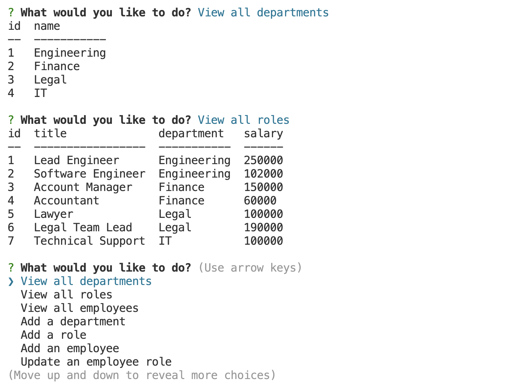

# 12 SQL Employee Tracker

## Description 
For the module 12 assignment I built an employee tracker in JavaScript. Employee information is stored in a MYSQL database. The application uses Node along with the Inquirer package to display employee information by collecting user input via the command line. 

A demo of the tool can be found here: https://drive.google.com/file/d/1lmHHUdttrpCwnjJ6D9-raFWV9wHvpCvH/view

## Installation
To install node on mac, use `brew install nvm` and `nvm install 16`.
Use `npm install` to install the MYSQL2 and inquirer package along with the other required packages.

## Usage
The user will need to type `node index.js` on the command line to launch a manu. The user can view and update department, role, and employee information.

## User Story

```
AS A business owner
I WANT to be able to view and manage the departments, roles, and employees in my company
SO THAT I can organize and plan my business
```

## Acceptance Criteria 

```
GIVEN a command-line application that accepts user input
WHEN I start the application
THEN I am presented with the following options: view all departments, view all roles, view all employees, add a department, add a role, add an employee, and update an employee role
WHEN I choose to view all departments
THEN I am presented with a formatted table showing department names and department ids
WHEN I choose to view all roles
THEN I am presented with the job title, role id, the department that role belongs to, and the salary for that role
WHEN I choose to view all employees
THEN I am presented with a formatted table showing employee data, including employee ids, first names, last names, job titles, departments, salaries, and managers that the employees report to
WHEN I choose to add a department
THEN I am prompted to enter the name of the department and that department is added to the database
WHEN I choose to add a role
THEN I am prompted to enter the name, salary, and department for the role and that role is added to the database
WHEN I choose to add an employee
THEN I am prompted to enter the employee’s first name, last name, role, and manager, and that employee is added to the database
WHEN I choose to update an employee role
THEN I am prompted to select an employee to update and their new role and this information is updated in the database
```

## Mock-Up

The following image shows the web application's appearance and functionality:

